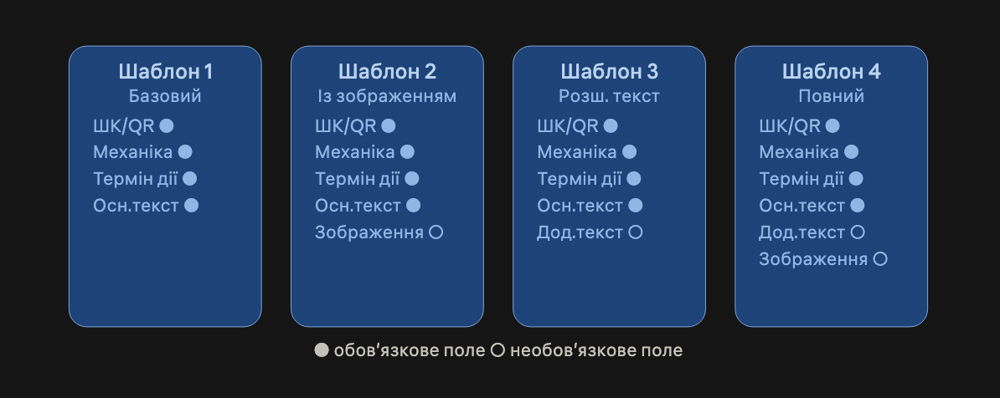

### Задача 2
#### **Написати перелік зауважень до статті: [Зміна вигляду друкованого купона](https://wiki.cashdesk.pro/index.php?title=%D0%97%D0%BC%D1%96%D0%BD%D0%B0_%D0%B2%D0%B8%D0%B3%D0%BB%D1%8F%D0%B4%D1%83_%D0%B4%D1%80%D1%83%D0%BA%D0%BE%D0%B2%D0%B0%D0%BD%D0%BE%D0%B3%D0%BE_%D0%BA%D1%83%D0%BF%D0%BE%D0%BD%D0%B0)**
#### **ТЗ, на підставі якого було реалізовано задачу: [Зміна друкованого вигляду купонів](https://docs.google.com/document/d/1w0dTC6ooBSslnoRhpnvt0astbOZTa5d8JrXfKGlCilw/edit?tab=t.0)**

Стаття виглядає як набір технічних деталей. Її потрібно переробити так, щоб вона була схожою на інструкцію для користувача. Щоб було зрозуміло:
- що користувач може зробити;
- як він може це налаштувати.

Рекомендовано змінити заголовок на більш інформативний. Поточний варіант `“Зміна вигляду друкованого купона”` сприймається так, ніби йдеться про зміну зовнішнього вигляду вже наявного купона. Але фактично було додано кілька шаблонів і налаштування до них. Рекомендований варіант заголовку `“Налаштування друку купона за шаблоном”`.

Основне зауваження по статті: 2 принципово різних рівні конфігурації подано як єдиний список. Через це не зрозуміло:
- де користувач вводить контент (текст, дати, зображення);
- а де задається геометрія/вигляд купона (координати, шрифти, розмір блоку).

Також у ТЗ зазначено, що залежно від обраного дизайну купона необхідно відображати відповідні поля для введення даних. У статті варто додати пояснення які є доступні шаблони і які поля передбачені для кожного шаблона. Орієнтовна структура - див. схему нижче:

Для зображення в ТЗ передбачені розмір, обсяг і контроль формату, а в статті описаний лише максимальний розмір. Також варто пояснити зв`язок дати шаблону з датами активності купона і перевірити друкарські помилки. 

Рекомендована структура статті:
1. Що змінилось
2. Доступні шаблони і поля (з обов`язковістю)
3. Налаштування для розробника (JSON, code_template, звіт №201)
4. Обмеження (підтримувані РРО/ПРРО)
5. Приклад заповнення
